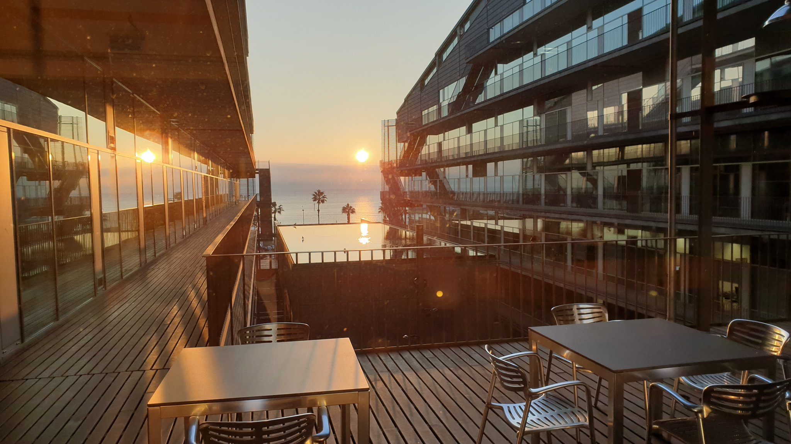

# MELIS PhD Association

## About us

Hey!!! We are the MELIS PhD student association, the first of its kind! 👨🏽‍🎓👩🏻‍🎓

This association started in 2023 as a small project from a group of motivated pre-doc students that saw a need for more support for PhD students. With time it has been slowly growing in numbers and expanded in its aims but the main goals still remain: give training, mental and health support to PhD students.

To help cover these goals we have different comittees with their own aims and activities. If you are interested in joining one of the comittees please check out the links 💪🏼!

slack link: [general_slack](https://melis-phd.slack.com/archives/C05DPSV6UKV)

Mail: melistes.upf@gmail.com

Twitter: [@MELIS_PhDs](https://x.com/MELIS_PhDs?t=K1gucV2ml7iLRrR3NukR0g&s=08)
