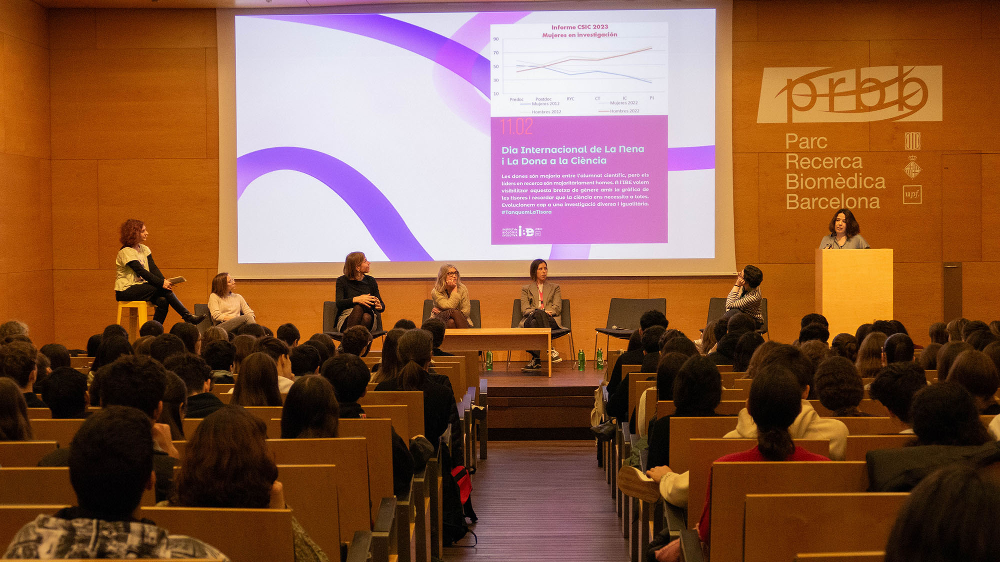

# Seminars organization commitee

The aim of this comittee is to organise seminars (also known as "Pizza seminars 🍕" in two formats:

-Chalk talks: These ones are for early PhD students that may not have any results yet or alternatively someone with an idea of a project in mind that wants feedback on feasability and suggestions.

-Classic powerpoint presentation: These are for later PhD students that may want to practise the more standard format for congresses and/or thesis defense.

-PhD Symposium: This is a yearly sevent in which students present their work with prizes as incentives.

Becoming part of this comittee will be an asset in your career development. Don't doubt and join us!

