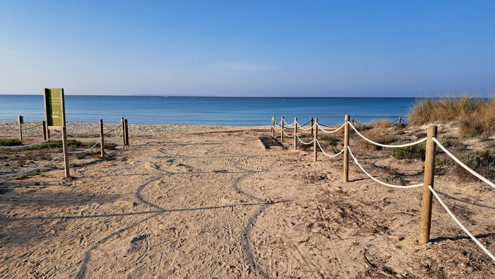

# Wellbeing/Student care committee

## Healthcare info 🚑

Committee dedicated to the mental health and physical health of PhD students. Here we collect all available resources for students regarding sports and mental health including information on (in the case of foreign students) how to register in a CAP, how to ask for an appointment, procedures etc. We also include steps on what to do when having issues with their PI or when having cases of abuse and/or discrimination. Please check the links bellow as a **first point of contact**. 

[📄Psychological support services](psychological_support.html)

[🏋Physical support serivices](physical_support.html)

[🏥Medical guide for international students](medical_guide.html)

[📣Harassment Protocol](harassment_protocol.html)

{: width="1000" }

